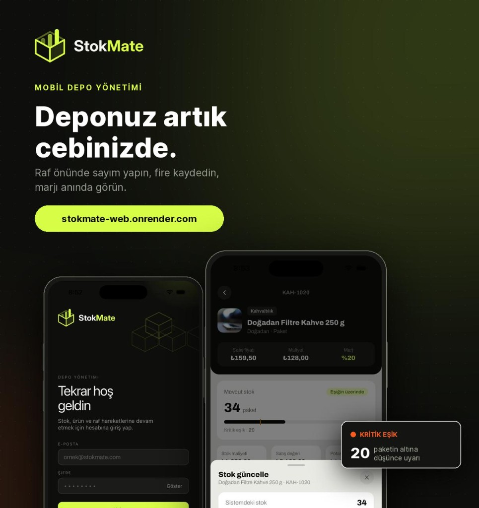

<div align="center">


<br />

**Mobil depo yönetim uygulaması** — raf önünde sayım yapın, stok girin, fire kaydedin, marjı anında görün.


<br />

<picture>
  
</picture>

<sub>Giriş · Ürün Detay · Stok Güncelleme — deponuz artık cebinizde</sub>

</div>

---

> ### 📦 Animasyonlu Splash
>
> Uygulama açıldığında StokMate logosunun SVG path'leri sırasıyla çizilir, çubuklar yükselir
> ve marka yazısı belirerek tam bir giriş deneyimi sunar. İlk açılışta tam animasyon (~4.8 sn),
> sonraki açılışlarda kısaltılmış versiyon (~2.2 sn) oynar.
>
> ```
> Native Splash ──▶ AnimatedSplash ──▶ Uygulama
>   (opak zemin)     │                   │
>                    ├── Çatı çizimi     ├── Auth kontrol
>                    ├── Yüz çizimi     ├── Font yükleme
>                    ├── Çubuk pop-up   └── Hydration
>                    ├── Dolgu fade
>                    └── "StokMate" yazı belirme
> ```

---

## Özellikler

| Modül | Açıklama |
|:------|:---------|
| **Ana Sayfa** | Ürün arama, kategori & marka filtresi, stok durumu chip'leri (tümü · kritik · tükendi) |
| **Ürün Detay** | Birim ekonomisi (satış fiyatı, maliyet, marj), stok gauge barı, kritik eşik göstergesi, son hareket logları |
| **Stok Güncelleme** | Sayım / Giriş / Fire modları, stepper ile miktar ayarlama, fark uyarı banner'ı |
| **Auth** | JWT tabanlı giriş, access + refresh token yönetimi (SecureStore), otomatik oturum yenileme |
| **Splash** | SVG path animasyonu ile animasyonlu giriş ekranı (Reanimated) |

---

## Kurulum ve Çalıştırma

> **Gereksinimler:** Node.js ≥ 18 · npm veya yarn · Expo CLI · iOS Simulator veya Android Emulator

```bash
# 1. Bağımlılıkları yükle
npm install

# 2. API adresini ayarla (varsayılan: localhost:5080)
#    src/config/index.ts dosyasından değiştirilebilir

# 3. Geliştirme sunucusunu başlat
npm start

# 4. Platforma göre çalıştır
npm run ios       # iOS Simulator
npm run android   # Android Emulator
```

| Komut | Açıklama |
|:------|:---------|
| `npm start` | Expo dev server (Metro bundler) |
| `npm run ios` | iOS Simulator'da çalıştır |
| `npm run android` | Android Emulator'da çalıştır |
| `npm run web` | Web tarayıcısında çalıştır |
| `npm run lint` | ESLint kontrolü |

---

## Proje Yapısı

```
src/
├── app/                # Expo Router sayfa dosyaları
│   ├── _layout.tsx     # Root layout (font, theme, auth guard, splash)
│   ├── index.tsx       # Ana sayfa (ürün listesi, arama, filtreler)
│   ├── product/[id].tsx# Ürün detay sayfası
│   └── sign-in.tsx     # Giriş sayfası
├── components/
│   ├── home/
│   │   ├── FilterSheet.tsx    # Kategori & marka bottom sheet filtresi
│   │   └── ProductCard.tsx    # Ürün kart bileşeni
│   ├── product/
│   │   └── StockUpdateSheet.tsx # Sayım / Giriş / Fire bottom sheet'i
│   ├── splash/
│   │   └── AnimatedSplash.tsx # SVG animasyonlu splash ekranı
│   └── ui/
│       └── ConfirmModal.tsx   # Onay diyaloğu
├── config/             # API base URL yapılandırması
├── constants/          # Renk paleti, boyutlar, stok sabitleri
├── lib/                # Yardımcı modüller (tema, toast, kategori görselleri)
├── services/           # API katmanı (axios + token yenileme interceptor'u)
│   ├── auth/           # Giriş, çıkış, kullanıcı bilgisi
│   ├── products/       # Ürün CRUD, stok işlemleri, hareket logları
│   └── request.ts      # Axios wrapper (401 → refresh → retry zinciri)
├── store/              # Zustand state yönetimi
│   ├── auth/           # Auth state (SecureStore persist)
│   └── system/         # Sistem state (loading spinner)
├── types/              # Merkezi TypeScript type tanımları
│   ├── product.ts      # Product, ProductDetail, ActivityLog vb.
│   ├── auth.ts         # AuthUser, AuthResponse, AuthState
│   ├── api.ts          # ApiResult<T>
│   ├── components.ts   # FilterOption, ConfirmModalProps
│   └── index.ts        # Barrel export
├── utils/              # Tarih, fiyat formatlama, hex alpha yardımcıları
└── validations/        # Yup form şemaları
```

---

## Auth Akışı

```
┌───────────┐   POST /auth/login    ┌─────────┐
│  Sign-In  │ ────────────────────▶ │   API   │
│  Sayfası  │ ◀──────────────────── │ Backend │
└─────┬─────┘  { accessToken,       └────┬────┘
      │          refreshToken }           │
      ▼                                   │
  SecureStore                             │
  ├── accessToken                         │
  ├── refreshToken                        │
  └── user                                │
      │                                   │
      ▼                                   │
┌──────────────┐ Authorization: Bearer    │
│   request()  │ ───────────────────────▶ │
│   (Axios)    │                          │
│              │◀── 401? ────────────────│
│              │                          │
│              │── POST /auth/refresh ──▶ │
│              │◀── yeni token ─────────│
│              │── orijinal istek (retry)▶│
└──────────────┘                          │
```

---

## Varsayımlar

- **API sunucusu hazır:** Backend REST endpoint'leri ve JWT auth altyapısı mevcut.
- **Tek depo modeli:** Uygulama tek bir depo üzerinden çalışır; çoklu depo desteği kapsam dışıdır.
- **Fiyatlar kuruş cinsinden:** Backend fiyatları kuruş (×100) olarak saklar; mobil uygulama TL gösterir.
- **Türkçe arayüz:** Tüm metinler, validasyon mesajları ve etiketler Türkçe'dir.
- **Mobil öncelikli:** Uygulama saha çalışanları için optimize edilmiştir; raf önünde hızlı sayım yapılabilir.
- **Tek kullanıcı oturumu:** Aynı anda tek bir aktif oturum varsayılır.
- **iOS & Android:** Her iki platform desteklenir; Expo managed workflow kullanılır.

---

## Kütüphane Tercihleri

| Kütüphane | Neden? |
|:----------|:-------|
| **Expo 57** | Managed workflow, OTA güncellemeler, native modül köprüsü olmadan hızlı geliştirme |
| **React Native 0.86** | New Architecture desteği, Fabric renderer, performans iyileştirmeleri |
| **TypeScript 6** | Compile-time tip güvenliği, IDE deneyimi, bakım kolaylığı |
| **Expo Router** | Dosya tabanlı routing, nested layout'lar, typed routes, deep linking |
| **NativeWind 4** | Tailwind CSS sözdizimi ile React Native stil yönetimi, hızlı prototipleme |
| **Zustand 5** | Minimal, hook tabanlı state yönetimi; SecureStore persist middleware |
| **Reanimated 4** | UI thread animasyonları, splash ve geçiş efektleri için 60fps performans |
| **Bottom Sheet** | @gorhom/bottom-sheet — gesture destekli, performanslı bottom sheet bileşeni |
| **Axios** | İstek/yanıt interceptor'ları (token enjeksiyonu, 401 → refresh → retry zinciri) |
| **Formik + Yup** | Deklaratif form yönetimi ve şema tabanlı validasyon |
| **Lucide Icons** | Tutarlı, hafif SVG ikon seti; tree-shakeable |
| **Day.js** | Hafif tarih kütüphanesi; göreli zaman formatlama ("5 dakika önce") |
| **Expo SecureStore** | Token'ların şifreli native depolaması (Keychain / Keystore) |
| **Expo Image** | Önbellekli, performanslı görsel yükleme (blurhash, geçiş animasyonu) |

---

## Renk Paleti

| Renk | Hex | Kullanım |
|:-----|:----|:---------|
| 🟢 Primary | `#D7FE47` | Aksan rengi, butonlar, aktif durumlar, chip seçimi |
| ⚫ Secondary | `#0E0F0C` | Header arka planı, koyu yüzeyler, ana metin |
| 🟠 Accent | `#FF5A1F` | Uyarılar, hata bildirimleri |
| ⚪ White | `#FFFFFF` | Kartlar, badge arka planları |
| 🔘 Canvas | `#E9EAE4` | Sayfa arka planı, nötr yüzeyler |

---

<div align="center">

<sub>Salih Kuloğlu · 2026</sub>

</div>
